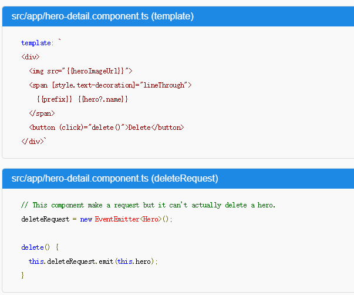

[TOC]

---

### 插值表达式
`{{expression}}`: Angular 对所有双花括号中的表达式求值，把求值的结果转换成字符串
### 模版表达式
`[property]="expression"`
#### 表达式上下文
表达式中的上下文变量是由模板变量、指令的上下文变量（如果有）和组件的成员叠加而成的。最常见的上下文是**组件实例：**是绑定值的来源。此外还包含**模版输入变量**`let hero`，**模版引用变量**`#heroInput`

**优先级：**模版变量 > 指令的上下文变量 > 组件的成员
### 模版语句
`(event)="statement"`
### 绑定语法

#### Html attribute 和 DOM property的区别
>*attribute 初始化 DOM property，然后它们的任务就完成了。property 的值可以改变；attribute 的值不能改变。*

>在 Angular 的世界中，attribute 唯一的作用是用来初始化元素和指令的状态。 当进行数据绑定时，只是在与元素和指令的 property 和事件打交道，而 attribute 就完全靠边站了

>*模板绑定是通过 property 和事件来工作的，而不是 attribute。*
#### 插值表达式
#### 属性绑定
#### attribute绑定
`<td [attr.colspan]="1 + 1">One-Two</td>`
>这是“绑定到目标属性 (property)”这条规则中唯一的例外。这是唯一的能创建和设置 attribute 的绑定形式。
#### CSS类绑定
`
The class binding is special
`
#### 样式绑定
`<button [style.color]="isSpecial ? 'red': 'green'">Red</button>`
#### 事件绑定
##### 自定义事件

#### 双向绑定

>当一个元素拥有可以设置的属性x和对应的事件xChange时，解释[(x)]语法就容易多了

**巨坑：想要绑定`ngModelChange`，一定要有`[ngModel]`。也就是说，不能单向绑定事件，想要绑定事件，必须要有属性绑定**

#### 内置指令
##### 内置属性型指令
- NgClass

- NgStyle
- NgModel
##### 内置结构型指令
- NgIf
- NgFor
- NgSwitch
- \#var
- @Input
- @Output
#### 模版表达式操作符
- 管道操作符 `|`
    - uppercase
    - lowercase
    - date
    - json
- 安全导航操作符 `?.`
- 非空断言操作符 `！`