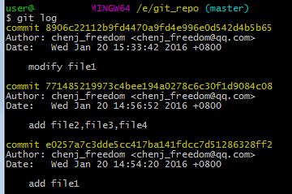

[TOC]

---

### git和SVN的区别
git是`分布式版本控制系统`，与`集中式版本控制系统`相对应。git提交代码是提交到本地，然后生成patch后push patch到远程仓库。
>代码仓库不仅包括了代码，还包括代码的各个历史版本信息。

git本没有中心服务器的概念，每个git节点都是一个完整的仓库。增加中心服务器是为了方便节点之间相互pull/push，要不然节点之间就要相互连接。


所以如果SVN挂了，可能你的本地还保存有代码，但是历史版本都不复存在了。git则不同，每个git客户端都是一个完整的代码仓库（前提是你从远程仓库fetch过代码）。所以历史版本信息都存储在本机上。如果哪一个git节点挂掉了，可以从其他仓库clone过来。

综上，每一个git节点都相当于一个SVN仓库。

### git工作原理


### 基本概念
#### 工作区、暂存区、版本库


- `工作区(working directory)`就是要被托管的代码文件夹。就是从git上clong下来的文件夹（除了.git文件夹）。
- `版本库(Repository)`就是.git文件夹。
- `暂存区(Stage)`就是版本库中的一个区域。就是每次add代码时提交的部分。
- `HEAD`表示当前分支中的当前版本，`HEAD^`表示上一个版本，`HEAD^^`表示上上一个版本，以此类推。如果要回退很早的版本就用`HEAD@{版本号}`，版本号用`git reflog`查看。

#### 分支
##### 使用场景
当你想要开发新功能时，往往会checkout一个新分支。新功能的完成进度会提交到新分支上，而不影响原来的分支。你的partner可以以同样方式在他自己的分支上开发特性模块。当你们都完成时，将自己的分支合并到master上就行了，同时删除dev_feature分支就行了。
##### 分支策略
- master分支是稳定的，用来发布的版本。平时不在master上开发。本地的master分支与远程保持同步。
- 平时开发在dev分支下。在某个时候，比如v1.0发布时，将dev合并到master上。dev分支也应与远程分支保持同步。
- 团队成员都在本地的个人分支上开发。时不时的想dev分支上pull/push（解决冲突）就行了。
- 功能（feature）分支
- 预发布（release）分支
- 修补bug（fixbug）分支


### git命令
#### 单机操作命令（本地仓库）
- `git init`: 创建版本库repository
- `git add`: 迁移文件：工作区 -> 暂存区
- `git commit`: 暂存区 -> 当前分支
- `git log`: 查看commit历史

- git reflog: 查看所有命令历史

- `git reset`: 
    - 用于撤销添加到暂存区(git add)
        ```
        git reset HEAD <filename>     // 取消暂存文件
        git checkout -- <filename>    // 撤销文件内容的修改
        ```
    - 撤销提交修改到版本库(git commit)
        ```
        git reset --hard HEAD^
        git reset --hard HEAD@{4}
        ```
#### 远程操作命令
- `git remote`: 查看远程仓库列表
- `git remote -v`: 详细信息
- `git remote add origin <url>`: 添加或者关联远程仓库
- `git clone <url>`: 克隆
- `git checkout -b <local-branch-name> <remote-host-name>/<remote-branch-name>`: 跟踪远程分支
- `git checkout --track <remote-host-name>/<remote-branch-name>`: 同上，本地分支只能与远程分支同名
- `git push <remote-host-name> <local-branch-name>:<remote-branch-name>`: 推送分支
    > 只有你的分支与远程分支完全相同，也即没有别人往远程分支提交的前提下，才能推送。否则只能先pull下来合并才行。

- `git fetch <remote-host-name>`: 抓取远程仓库所有分支内容，但是**不会自动合并**
    
- `git pull`: 抓取远程仓库**跟踪分支**的内容，并且自动合并
- `git push <remote-host-name> :<remote-branch-name>`: 提交空分支到远程，即删除远程分支
- `git remote rm <remote-host-name>`: 删除远程主机关联

#### 分支管理命令
- `git branch`: 查看分支
- `git branch -a`: 查看所有分支，包括远程分支
- `git branch dev_shencr`: 新建分支
- `git checkout`: 切换分支
- `git checkout -b dev_shencr`: 创建并切换分支
- `git merge --no-f -m "commit comment" dev_shencr`: 禁用fast forward模式合并分支
- `git merge dev_shencr`: 启用fast forward模式合并分支
    > 在Fast forward模式下，当删除分支后，会丢掉分支信息。
- `git branch -d <local-branch-name>`: 删除本地分支
- `git branch -D <local-branch-name>`: 强行删除掉还未合并的分支
- `git stash`: 存储工作区工作现场，并将工作区恢复到上次pull下来的状态
- `git stash list`: 查看工作现场列表
- `git stash pop stash@{0}`: 恢复工作现场

#### 容易纠结的地方
- `origin/master`与`origin master`:
    从服务器取到本地的文件，在本地主机上要用`origin/master`的形式获取，而在远程主机主机上的分支要用`origin master`来获取


### git设置
#### SSH

### github原理


### 参考
- [oschina git教程](http://git.oschina.net/progit/)
- [廖雪峰](http://www.liaoxuefeng.com/wiki/0013739516305929606dd18361248578c67b8067c8c017b000)
- [分支管理策略](http://www.ruanyifeng.com/blog/2012/07/git.html)
- [一张图看明白Git的四个区五种状态](http://imtuzi.com/post/git-four-areas-five-states.html)