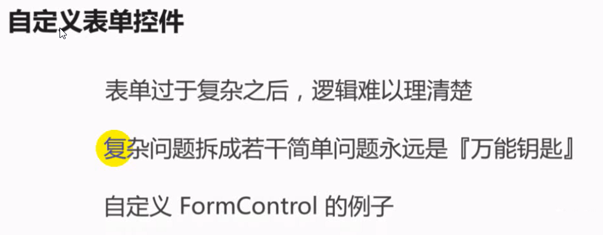

[TOC]

---

## @angular/cli

- ng new
- ng g
- ng test
- ng build
- ng serve

## 项目构建流程


## 项目工程结构

- root module
- core module
- feature module
    - login：预加载
    - ...：懒加载
- shared module


## core module

    只加载一次的组件或服务，可以包括：
    - 通用的layout
    - 全局加载资源，比如：font icon

## 快捷开发

- 后台测试：postman、rest client
- 前台mock api：json-server
- core模块：只加载一次的东西放在这里

## 组件通信

- 父组件 -> 子组件：Input装饰器装饰的属性绑定
- 子组件 -> 父组件：Output装饰器装饰的事件绑定

## 聪明组件和笨组件

- 聪明组件：
- 笨组件：越简单越好，所有逻辑不做处理，直接通过Output传递到父组件那一层。扩展性非常高。

## Material

## animation


## 重新认识Angular

### 依赖注入

- 令牌
- useExisting
- useClass
- useValue


### 变化检测


### 指令

#### 结构型指令

- ngIf
- ngFor

#### 属性型指令

- ngClass: 字典类型
- ngStyle: 字典类型
- class.className: boolean

#### 指令详解

- ng-container: 在渲染时是什么都没有的。比如如下代码，.flex下面的三个div具有相同的地位。
```
<div class="flex">
  <div></div>
  <ng-container>
    <div></div>
    <div></div>
  </ng-container>
</div>
```

- `:host`：用在css里，指宿主元素。即组件的元数据中的selector的名字包装的那一层，如`<app-visual-list>...</app-visual-list>`

### 装饰器

#### 类装饰器

- `@NgModule`
    #### 元数据
    - `imports`: 
    - `providers`:
    - `bootstrap`:
    - `declarations`:
    - `entryComponents`: 一开始进来模块时就加在，而不是调用时在加载。比如material的对话框组件，他不是显示的，而是通过某种方式动态触发的。
    - `exports`: 导出供其他模块使用的。
    - `forRoot(forChild)`: 当元数据需要配置，不同情况下元数据不同时，通过静态工厂方法，返回一个module（ModuleWithProviders）
- `@Component`
- `@Directive`
- `@Pipe`
- `@Injectable`: 标记元数据并可以使用Injector注入器注入

#### 属性装饰器

- @Input: 声明一个输入属性，以便我们可以通过属性绑定更新它
- @Output: 声明一个输出属性，以便我们可以通过事件绑定进行订阅
- @HostBinding: 把宿主元素的属性(比如CSS类）绑定到指令/组件的属性
- @HostListener: 通过指令/组件的方法订阅宿主元素的事件
- @ContentChild: 配置一个内容查询
- @ViewChild: 配置一个视图查询
- @ContentChildren: 配置多个个内容查询(返回QueryList类型)
- @ViewChildren: 配置多个视图查询(返回QueryList类型)

#### 参数装饰器

- @Inject: 指定依赖关系的参数装饰器(一般用来注入被标记Injectable的类)
- @Optional: 将依赖项标记为可选的参数元数据. 如果没有找到依赖关系,注射器将提供null
- @Self: 指定注射器只能从本身检索依赖关系
- @SkipSelf: 指定注射器只能从父类检索依赖关系
- @Host: 按照依赖关系来检索


### 表单

#### 模板驱动表单

他把所有的验证工作在模板中完成，适用简单的表单，优点是直观。

#### 响应式表单

把验证工作放在组建中处理，包括异步验证。
- FormControl
- FormGroup
- FormBuild


#### 自定义表单



## RxJS