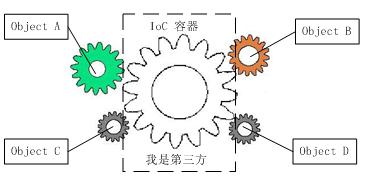

[TOC]

---

# 控制反转

控制反转是一种思维方式。

- 传统的在没有控制反转容器时，如图1所示，如果对象A依赖于对象B，那么对象A在初始化或者运行到某一点的时候，自己必须主动去创建对象B或者使用已经创建的对象B。无论是创建还是使用对象B，控制权都在自己手上。
    
- 在引入IoC容器后，这种情形就完全改变了，如图2所示，由于IOC容器的加入，对象A与对象B之间失去了直接联系，所以，当对象A运行到需要对象B的时候，IOC容器会主动创建一个对象B注入到对象A需要的地方。
    

通过对比来看，对象A获得依赖对象B的过程,由主动行为变为了被动行为，控制权颠倒过来了，这就是“控制反转”这个名称的由来。

## 什么是依赖

如果在 Class A 中，有 Class B 的实例，则称 Class A 对 Class B 有一个依赖。


# 依赖注入

依赖注入是控制反转的一种实现方式。
像下面这种非自己主动初始化依赖，而通过外部来传入依赖的方式，我们就称为依赖注入。
```
public class Human {
    ...
    Father father;
    ...
    public Human(Father father) {
        this.father = father;
    }
}
```
# Angular中的依赖注入

依赖注入其实是将创建依赖类这一项工作不断的推卸调，让上层调用者去做。如果是在普通的程序中，就是在main函数中做。但是在main函数中创建、维护和释放这些类的实例，工作量就会显得很大。依赖注入框架所做的工作就是创建、维护和释放依赖项的实例，这样就可以将工作重心放在业务逻辑处理上。Angular中的依赖注入框架其实也是如此。

## 几个概念

- **注入器（Injector）**：就像制造工厂，提供了一系列的接口，用于创建依赖对象的实例。
- **提供商（Provider）**：令牌。用于配置注入器，注入器通过它来**创建被依赖对象的实例**，Provider把令牌(Token)映射到工厂方法，被依赖的对象就是通过这个方法创建的。
- **依赖（Denpendence）**：指定了被依赖对象的类型，注入器会根据此类型创建对应的对象。

## 注册服务的方法

`provide`表示令牌，用于定位依赖。这个其实就是后面程序中使用的服务的名字。
### Angular中的依赖注入类型

- `useClass`: 类提供商，是默认的，可以不加useClass
- `useExisting`: 别名提供商，使用别名来使用相同的提供商。比如在迭代过程中，想使用新的服务替换老的服务时可以这样用。
- `useValue`: 值提供商。
- `useFactory`: 工厂提供商。有时我们需要**动态创建这个依赖值**,因为它所需要的信息我们直到最后一刻才能确定。
    ```ts
    // app.module.ts
    @NgModule({
    // ...
    providers: [
        HeroService,
        ConsoleService,
        {
            provide: LoggerService, 
            useFactory: (consoleService) => {
                return new LoggerService(true, consoleService);
            },
            deps: [ConsoleService]
        }
    ],
    bootstrap: [AppComponent]
    })
    export class AppModule { }
    ```
    ```
    // console.service.ts
    // ...
    export class ConsoleService {
        log(message) {
        console.log(`ConsoleService: ${message}`);
        }
    }

    // logger.service.ts
    // ...
    export class LoggerService {
        constructor(private enable: boolean, 
            consoleService: ConsoleService
        ) { }

        log(message: string) {
        if (this.enable) {
            console.log(`LoggerService: ${message}`);
        }
        }
    }
    ```

### 注意事项

#### OpaqueToken

使用`useValue`类型的依赖注入注入值时，`provide`令牌不能是接口，可以是`string`或者`类`类型的。
对于接口类型，可以使用`OpaqueToken`（不透明的令牌）来处理。好像是只多了一个强类型信息。
```
// 首先导入 OpaqueToken和Inject
import {Component, Injector, OpaqueToken, Inject} from '@angular/core';
// 引入AppConf,并且使用OpaqueToken
import {AppConf} from "./config/app-config";
let APP_CONFIG = new OpaqueToken('./config/app-config');
// 在providers中进行配置
{provide: APP_CONFIG, useValue: AppConf}
// 在类中使用
constructor(private userService: UserService, private userService2: UserService2, @Inject(APP_CONFIG) appConf: AppConfig) {
    this.users = userService.getUsers();
    console.log(this.userService2.getUsers());
    console.log(appConf);
}
```

#### 依赖的服务还有其他依赖时
```
@Component({
    selector: 'my-app',
    templateUrl: 'app/templates/app.html',
    providers: [
        //Logger,
        //[{provide: Logger, useClass: BetterLogger}],
        // BetterLogger和Logger依赖于Loggerhelper
        [LoggerHelper, {provide: BetterLogger, useClass: BetterLogger}],
        [LoggerHelper, {provide: Logger, useExisting: BetterLogger}],
        UserService
    ]
})
```

#### 层级注入关系

可以使用一个生成随机数的服务测试。
- 在模块中注入的服务，整个模块使用同一个实例；
- 在父组件中注入的服务，子组件使用同一个实例；
- 在子组件中注入的服务，两个子组件使用不同的实例；

##### 如何查找合适的服务实例

在组件的构造函数视图注入某个服务的时候，Angular会先从当前组件的注入器中查找，找不到就继续往父组件的注入器查找，直到根组件注入器，最后到应用根注入器，此时找不到的话就会报错。

##### 组件继承与派生时的服务依赖注入

一个组件可以派生与另一个组件，对于有继承关系的组件，当父类组件和派生类组件有相同的依赖注入时，如果父类组件注入了这些依赖，派生组件也需要注入这些相同的依赖，并在派生类组件的构造函数中通过super()的参数往上传递。

##### 获取父组件？？？

通常来说获取父组件就是获取一个已经存在的组件类型，父组件必须通过提供一个与别名提供者来实现，例如
```
providers: [{provide: Parent, useExisting: forwardRef(() => ParentComponent) }]
```
Parent 是该提供商的令牌, ParentComponent就是该别名提供商的类型，将该类型提供商注入到父组件的注入器中，则子组件可以使用Parent令牌作为构造函数参数类型来注入该服务，获取ParentComponent。 ParentComponent引用了自身，造成循环引用，必须使用 前向引用forwardRef 打破了该循环，查找当前或者父级的提供商。

### 装饰器

#### @Optional

有些服务的依赖不是必须的，此时使用@Optional()装饰。如果没有注入这一项依赖，那么这一项就会为空。

#### @Inject

#### @Injectable

用@Injectable()装饰的类标志着这个类可以被注入器实例化

#### @Host

依赖查找的规则是按照注入器从当前组件向父组件查找，直到找到要注入的依赖为止。但有时候想限制默认的查找规则，**@Host 装饰器将把往上搜索的行为截止在宿主组件**。

**宿主组件**如果一个组件注入了依赖项，那么这个组件就是这个依赖的宿主组件；如果这个组件通过<ng-content>被嵌入到了父组件，那这个父组件就是这个依赖的宿主组件。

#### @SkipSelf

当我们不想从当前元素获取依赖的时候，可以使用@SkipSelf()，这样注入器从一个在自己上一级的组件开始搜索依赖

# 参考资料

[控制反转和依赖注入](http://blog.xiaohansong.com/2015/10/21/IoC-and-DI/)<br>
[Angular中的依赖注入](https://segmentfault.com/a/1190000006672079)<br>
[Angular依赖注入原理](https://www.cnblogs.com/etoah/p/5460441.html)<br>
[Angular中的依赖注入](http://blog.csdn.net/anxiaomo1/article/details/70805167)<br>