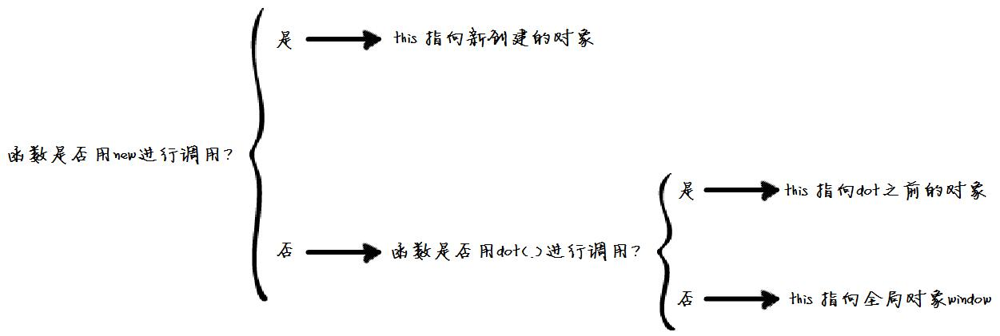

函数中 this 的指向与函数定义无关，而与**调用方式**有关，常见的4中调用方式
- 作为对象方法调用：指向对象
- 作为函数直接调用：指向全局变量
- 作为构造函数调用：指向构造的对象
- 使用 apply, call, bind 调用：指向绑定的对象



# 直接调用
这里需要注意的一点是，直接调用并不是指在全局作用域下进行调用，在任何作用域下，直接通过 `函数名(...)` 来对函数进行调用的方式，都称为直接调用。
```
// 简单兼容浏览器和 NodeJs 的全局对象
const _global = typeof window === "undefined" ? global : window;

function test() {
    console.log(this === _global);    // true
}

test();    // 直接调用
```
```
(function(_global) {
    // 通过 IIFE 限定作用域

    function test() {
        console.log(this === _global);  // true
    }

    test();     // 非全局作用域下的直接调用
})(typeof window === "undefined" ? global : window);
```

## apply, call, bind 对 this 的影响
``` JavaScript
function a(xx) {        
    this.b = xx;
}
var o = {};
a.apply(o, [5]);
a.call(o, 5);
alert(a.b);    // undefined
alert(o.b);    // 5
```

如果目标函数本身使用 bind 绑定了this对象，那么 apply 和 call 不会像预期那样执行：
``` javascript
const obj = {};

function test() {
    console.log(this === obj);
}

// 绑定到一个新对象，而不是 obj
const testObj = test.bind({});
test.apply(obj);    // true

// 期望 this 是 obj，即输出 true
// 但是因为 testObj 绑定了不是 obj 的对象，所以会输出 false
testObj.apply(obj); // false
```

如果apply的参数为空，默认调用全局对象

## 对比
| name| 立即调用 | 参数形式 |
| ---- | ---- | ---- |
|apply| 是 | 数组 | 
|call| 是 | 不定参数 |
| bind | 否 | 不定参数 |

# 方法调用
方法调用是指通过对象来调用其方法函数，它是 `对象.方法函数(...)` 这样的调用形式。这种情况下，函数中的 this 指向调用该方法的对象。但是，同样需要注意 bind() 的影响。
```
const obj = {
    // 第一种方式，定义对象的时候定义其方法
    test() {
        console.log(this === obj);
    }
};

// 第二种方式，对象定义好之后为其附加一个方法(函数表达式)
obj.test2 = function() {
    console.log(this === obj);
};

// 第三种方式和第二种方式原理相同
// 是对象定义好之后为其附加一个方法(函数定义)
function t() {
    console.log(this === obj);
}
obj.test3 = t;

// 这也是为对象附加一个方法函数
// 但是这个函数绑定了一个不是 obj 的其它对象
obj.test4 = (function() {
    console.log(this === obj);
}).bind({});

obj.test();     // true
obj.test2();    // true
obj.test3();    // true

// 受 bind() 影响，test4 中的 this 指向不是 obj
obj.test4();    // false
```
## 方法中 this 指向全局对象的情况
```
const obj = {
    test() {
        console.log(this === obj);
    }
};

const t = obj.test;
t();    // false
```
```
function foo() {
  console.log(this.a);
}
var obj = {
  a: 2,
  foo: foo
};
var a = "oops, global";
// 作为回调函数用时，实际上还是当做函数直接调用，而不是当做对象的方法调用
setTimeout(obj.foo, 100); // ？
obj.foo();
```

# new 调用

# 箭头函数调用

# 参考
[JavaScript中的this指向](https://segmentfault.com/a/1190000008400124)
[图解javascript this指向什么？](https://www.cnblogs.com/isaboy/p/javascript_this.html)