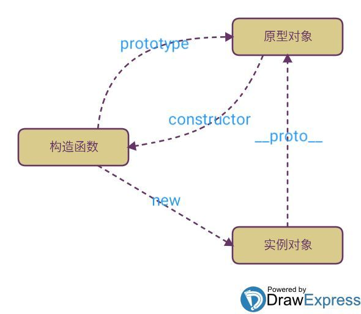

构造函数、实例对象、原型对象三者的关系通过 __proto__, prototype, new 关联


# prototype
每个函数都有一个 prototype 属性，这个属性指向通过该函数创建的***实例**的原型*
``` js
function Person() {

}
// 虽然写在注释里，但是你要注意：
// prototype是函数才会有的属性
Person.prototype.name = 'Kevin';
var person1 = new Person();
var person2 = new Person();
console.log(person1.name) // Kevin
console.log(person2.name) // Kevin
```
每一个JavaScript对象(null除外)在创建的时候就会与之关联另一个对象，这个对象就是我们所说的原型，每一个对象都会从原型"继承"属性

# __proto__
每个 js 对象都具有一个 __proto__ 属性，这个属性指向该*对象的原型*。
```js
function Person() {}
var person = new Person();
console.log(person.__proto__ === Person.prototype); // true
// __proto__ 是浏览器商的实现，getPrototypeOf 是ES5的方法
console.log(Object.getPrototypeOf(person) === Person.prototype) // true
```

# constructor
每个原型对象都有一个 constructor 属性，指向构造函数。
```js
function Person() {}
console.log(Person === Person.prototype.constructor); // true
```

# 实例与原型
当读取实例的属性时，如果找不到，就会查找与对象关联的原型中的属性，如果还查不到，就去找原型的原型，一直找到最顶层为止。

# 原型的原型
原型对象也是对象，也可以通过构造函数的方式创建，也具备原型。
```js
var obj = new Object();
obj.name = 'Kevin'
console.log(obj.name) // Kevin
```


# 原型链
那 Object.prototype 的原型呢？null，我们可以打印：
```js
console.log(Object.prototype.__proto__ === null) // true
```
然而 null 究竟代表了什么呢？引用阮一峰老师的 《undefined与null的区别》 就是：
> null 表示“没有对象”，即该处不应该有值。

所以 Object.prototype.__proto__ 的值为 null 跟 Object.prototype 没有原型，其实表达了一个意思。所以查找属性的时候查到 Object.prototype 就可以停止查找了。最后一张关系图也可以更新为：

顺便还要说一下，图中由相互关联的原型组成的链状结构就是原型链，也就是蓝色的这条线。

# 真的是继承吗？
最后是关于继承，前面我们讲到“每一个对象都会从原型‘继承’属性”，实际上，继承是一个十分具有迷惑性的说法，引用《你不知道的JavaScript》中的话，就是：
>继承意味着复制操作，然而 JavaScript 默认并不会复制对象的属性，相反，JavaScript 只是在两个对象之间创建一个关联，这样，一个对象就可以通过委托访问另一个对象的属性和函数，所以与其叫继承，委托的说法反而更准确些。

# 构造器
构造器函数既可以当做函数，又可以当做对象。
- 作为函数时，可以用来构造实例
- 作为对象时，是通过 Function 构造出来的实例。所有构造器都继承了 Function.prototype 的属性及方法。如length、call、apply、bind
所以，所有的构造函数，都有：
```js
Fun.__proto__ === Function.prototype // true

Number.__proto__ === Function.prototype  // true
Number.constructor == Function //true

Boolean.__proto__ === Function.prototype // true
Boolean.constructor == Function //true

String.__proto__ === Function.prototype  // true
String.constructor == Function //true

// 所有的构造器都来自于Function.prototype，甚至包括根构造器Object及Function自身
Object.__proto__ === Function.prototype  // true
Object.constructor == Function // true

// 所有的构造器都来自于Function.prototype，甚至包括根构造器Object及Function自身
Function.__proto__ === Function.prototype // true
Function.constructor == Function //true

Array.__proto__ === Function.prototype   // true
Array.constructor == Function //true

RegExp.__proto__ === Function.prototype  // true
RegExp.constructor == Function //true

Error.__proto__ === Function.prototype   // true
Error.constructor == Function //true

Date.__proto__ === Function.prototype    // true
Date.constructor == Function //true
```

```js
// 所有原型对象都是一个普通对象（除了Function）
Object.prototype.__proto__ === null // true
obj.__proto__ === Object.prototype // true
console.log(typeof Function.prototype) // function
console.log(typeof Object.prototype)   // object
console.log(typeof Number.prototype)   // object
console.log(typeof Boolean.prototype)  // object
console.log(typeof String.prototype)   // object
console.log(typeof Array.prototype)    // object
console.log(typeof RegExp.prototype)   // object
console.log(typeof Error.prototype)    // object
console.log(typeof Date.prototype)     // object
console.log(typeof Object.prototype)   // object
```

# 参考
[MDN 继承与原型链](https://developer.mozilla.org/zh-CN/docs/Web/JavaScript/Inheritance_and_the_prototype_chain)<br>
[JavaScript深入之从原型到原型链](https://github.com/mqyqingfeng/Blog/issues/2)