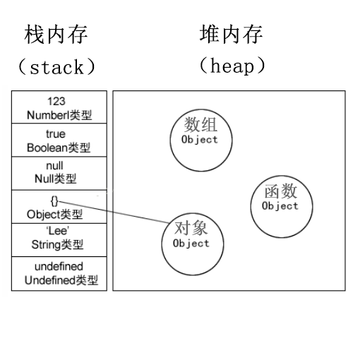

# js 中的堆内存和栈内存
首先JavaScript中的变量分为基本类型和引用类型。
- 基本类型就是保存在栈内存中的简单数据段
- 引用类型指的是那些保存在堆内存中的对象。

1、基本类型 
    基本类型有Undefined、Null、Boolean、Number 和String。这些类型在内存中分别占有固定大小的空间，他们的值保存在栈空间，我们通过按值来访问的。

2、引用类型
    引用类型，值大小不固定，栈内存中存放地址指向堆内存中的对象。是按引用访问的。如下图所示：栈内存中存放的只是该对象的访问地址，在堆内存中为这个值分配空间。由于这种值的大小不固定，因此不能把它们保存到栈内存中。但内存地址大小的固定的，因此可以将内存地址保存在栈内存中。 这样，当查询引用类型的变量时， 先从栈中读取内存地址， 然后再通过地址找到堆中的值。对于这种，我们把它叫做按引用访问。

# 其他语言中的内存分配类似:
    PS：当我们看到一个变量类型是已知的，就分配在栈里面，比如INT,Double等。其他未知的类型，比如自定义的类型，因为系统不知道需要多大，所以程序自己申请，这样就分配在堆里面。

# 为什么会有栈内存和堆内存之分？
    通常与垃圾回收机制有关。为了使程序运行时占用的内存最小。

    当一个方法执行时，每个方法都会建立自己的内存栈，在这个方法内定义的变量将会逐个放入这块栈内存里，随着方法的执行结束，这个方法的内存栈也将自然销毁了。因此，所有在方法中定义的变量都是放在栈内存中的；

    当我们在程序中创建一个对象时，这个对象将被保存到运行时数据区中，以便反复利用（因为对象的创建成本通常较大），这个运行时数据区就是堆内存。堆内存中的对象不会随方法的结束而销毁，即使方法结束后，这个对象还可能被另一个引用变量所引用（方法的参数传递时很常见），则这个对象依然不会被销毁，只有当一个对象没有任何引用变量引用它时，系统的垃圾回收机制才会在核实的时候回收它。

# 参考
[JavaScript变量——栈内存or堆内存](https://blog.csdn.net/xdd19910505/article/details/41900693)