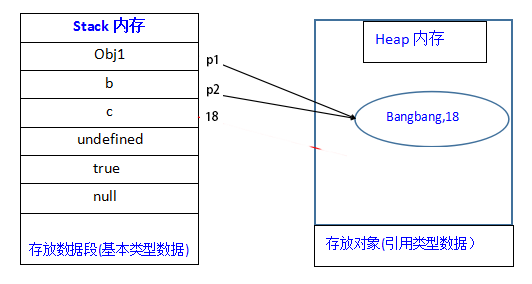

# 例子
```js
var obj1 = {name:'bangbang',age:18};
var b = obj1;
var c = obj1.age;

console.log(b.name); //bangbang
console.log(c);      //18
//改变b和c的值
b.name = 'yanniu';
c = 22;
console.log(obj1.name);     //yanniu
console.log(obj1.age);       //18
```


# 深拷贝和浅拷贝
**基本类型**拷贝的时候是在栈内存中开辟了新的空间，和被拷贝的元素值相等，因此`基本类型的拷贝都是深拷贝`。
因深浅拷贝是针对于**引用类型**而言的。