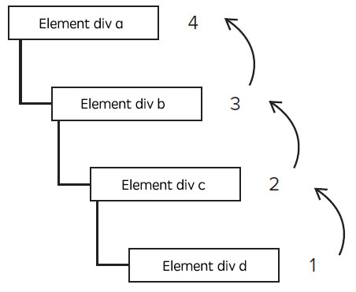

[TOC]

---

读定义总是很绕，要彻底了解这两者的区别，我们要先了解浏览器中事件传递的机制冒泡和捕获。

# 冒泡和捕获
在页面中点击一个元素，事件是从这个元素的祖先元素中逐层传递下来的，这个阶段为事件的**捕获**阶段。当事件传递到这个元素之后，又会把事件逐成传递回去，直到根元素为止，这个阶段是事件的**冒泡**阶段。


我们为一个元素绑定一个点击事件的时候，可以指定是要在捕获阶段绑定或者换在冒泡阶段绑定。 当addEventListener的第三个参数为true的时候，代表是在捕获阶段绑定，当第三个参数为false或者为空的时候，代表在冒泡阶段绑定。

知道事件有这么一个穿透的过程之后，结合下面的例子，就可以很好来理解event.target和event.currentTarget：
``` html
<div id="a">
    <div id="b">
      <div id="c">
        <div id="d"></div>
      </div>
    </div>
</div>

<script>
    document.getElementById('a').addEventListener('click', function(e) {
      console.log('target:' + e.target.id + '&currentTarget:' + e.currentTarget.id);
    });    
    document.getElementById('b').addEventListener('click', function(e) {
      console.log('target:' + e.target.id + '&currentTarget:' + e.currentTarget.id);
    });    
    document.getElementById('c').addEventListener('click', function(e) {
      console.log('target:' + e.target.id + '&currentTarget:' + e.currentTarget.id);
    });    
    document.getElementById('d').addEventListener('click', function(e) {
      console.log('target:' + e.target.id + '&currentTarget:' + e.currentTarget.id);
    });
</script>
```
上面事件的绑定都是在冒泡阶段的，当我们点击最里层的元素d的时候，会依次输出:
``` js
target:d&currentTarget:d
target:d&currentTarget:c
target:d&currentTarget:b
target:d&currentTarget:a
```
从输出中我们可以看到，event.target指向引起触发事件的元素，而event.currentTarget则是事件绑定的元素，只有被点击的那个目标元素的event.target才会等于event.currentTarget。

如果我们把事件都绑定在捕获阶段，然后还是点击最里层的元素d，这时event.target还依旧会指向d，因为那是引起事件触发的元素，因为event.currentTaget指向事件绑定的元素，所以在捕获阶段，最先来到的元素是a,然后是b,接着是c,最后是d。所以输出的内容如下：
``` js
target:d&currentTarget:a
target:d&currentTarget:b
target:d&currentTarget:c
target:d&currentTarget:d
```

# 其他
- `target`：最初触发的DOM元素
- `currentTarget`：事件冒泡阶段的DOM元素
- `delegateTarget`：委托的目标元素，通过 `delegate` 绑定事件时可以使用
- `relatedTarget`：relatedTarget 事件属性返回与事件的目标节点相关的节点。
对于 `mouseover` 事件来说，该属性是鼠标指针移到目标节点上时所离开的那个节点。
对于 `mouseout` 事件来说，该属性是离开目标时，鼠标指针进入的节点。
对于其他类型的事件来说，这个属性没有用。