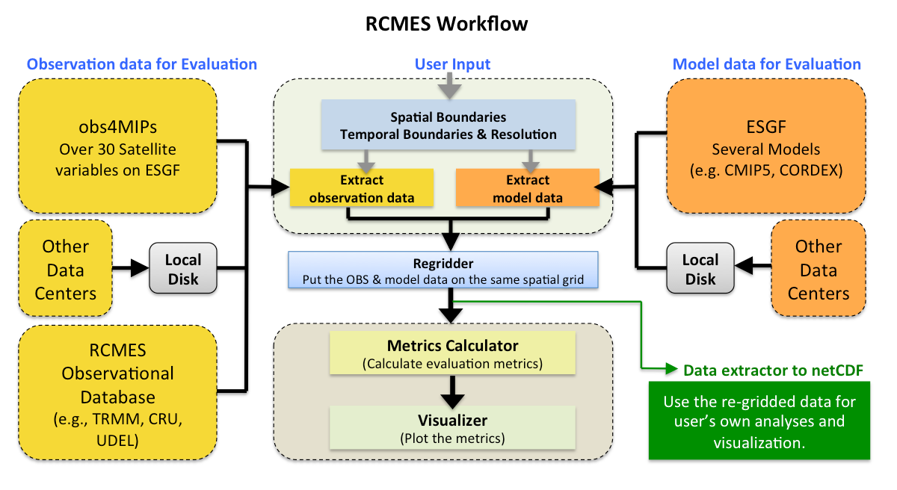
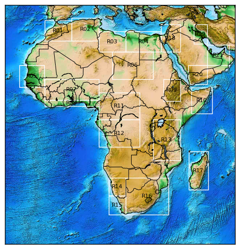
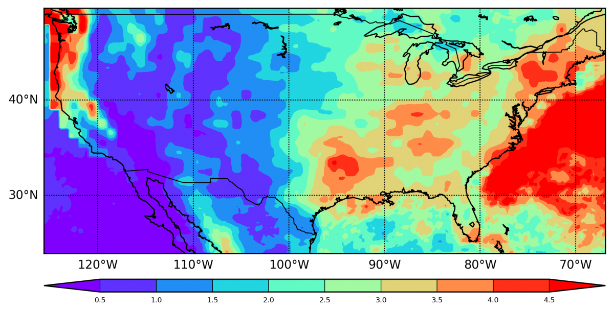
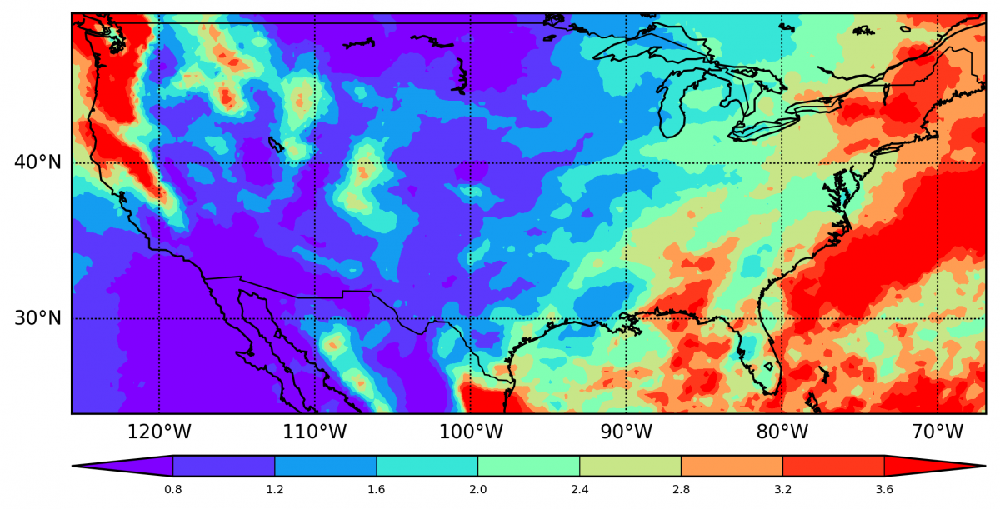
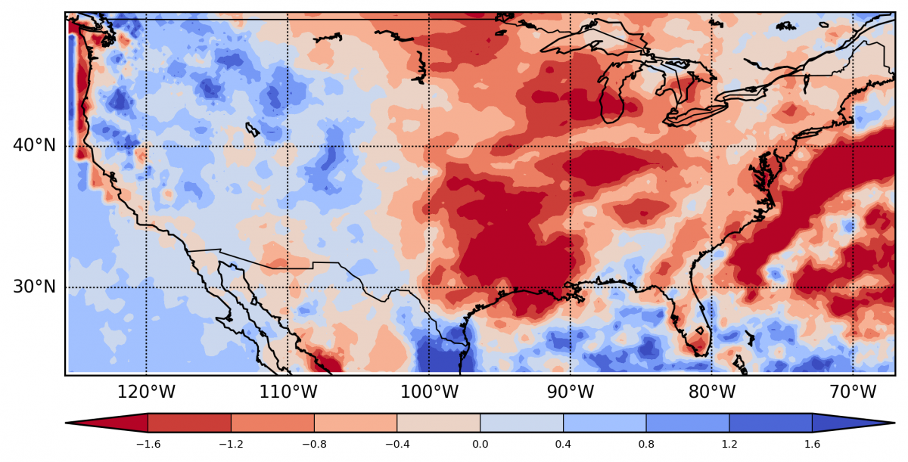
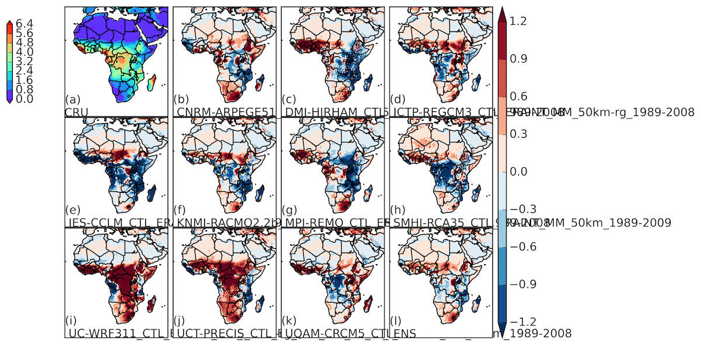
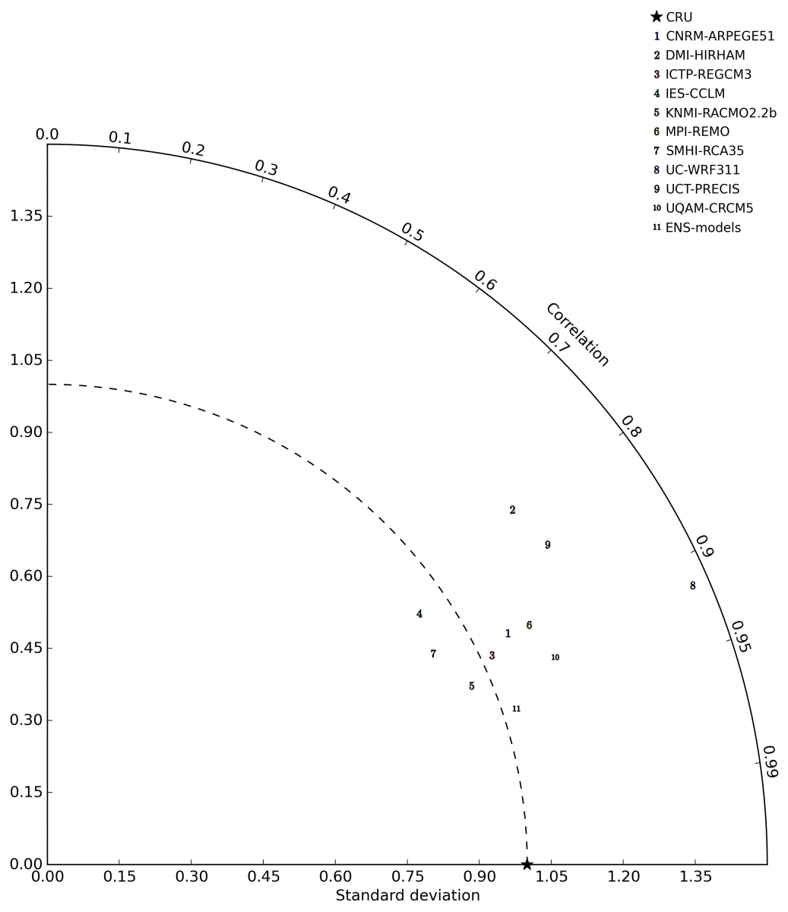
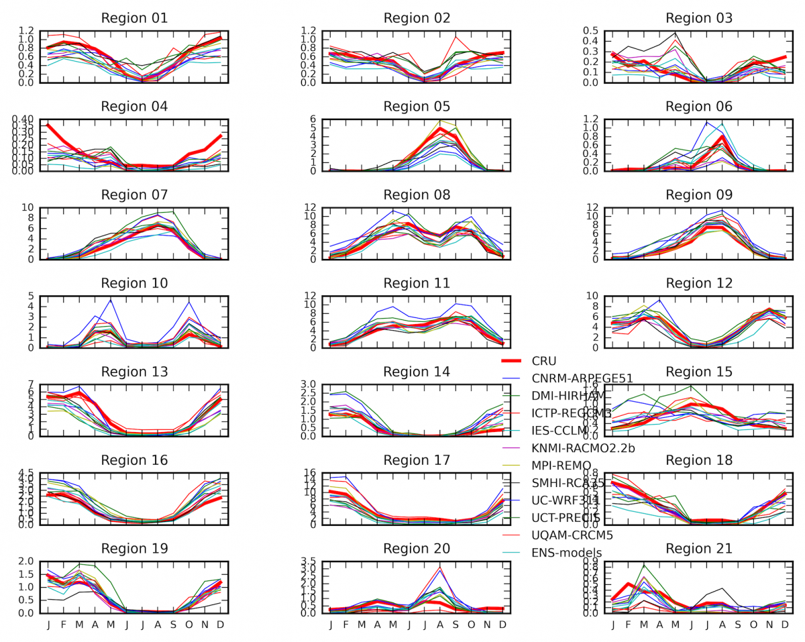
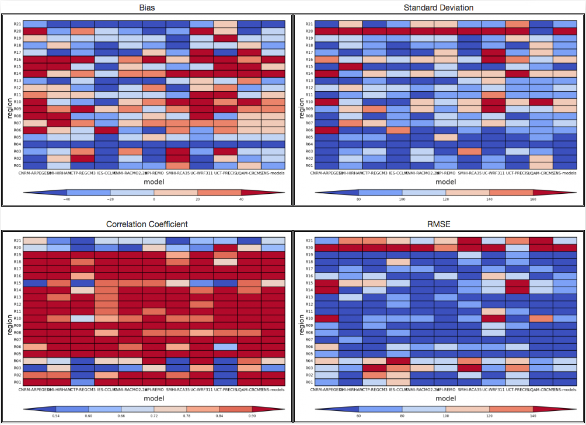

# 气候模型特征

# 模型数据特征

# 比较方法
## 实验协议/方案，注册实验，专家审核，开放实验结果
协议包括实验的细节，如CORDEX_ESD实验的协议包括：
1. 预测因子：
    - 数据源：ERA-I 1979-2013
    - 变量：
    - 空间分辨率：任何ERA-I的原生或后处理的空间分辨率
    - 时间分辨率：任何ERA-I的原生或后处理的时间分辨率
    - 其他预测因子：
2. 预测值：
    - CLARIS LPB数据集的站点日数据
    - Tmin, Tmax, Precipitation(pr)
3. 时间范围：1979-2013
4. 结果提交：
    - NetCDF：满足附录表描述要求的文件
    - 文本文件：和预测值数据相同格式的
5. 实验环节：
6. 分析和诊断：

## 统计方法
指标：
- Bias  (i.e. spatial grid of differences)
- Temporal Standard Deviation
- Standard Deviation Ratio
- Pattern Correlation
- Temporal Correlation
- Temporal Mean Bias
- RMS Error (with mean computed over time and space)

[统计降尺度](https://rcmes.jpl.nasa.gov/content/statistical-downscaling)：（缩小的未来）=（当前观察）+（当前模拟和未来模拟之间的平均差异）

## 比较案例
[an end-to-end evaluation of CORDEX Africa regional climate models](https://rcmes.jpl.nasa.gov/content/configuration-files-kim-et-al-2013a)，[下载文章](https://link.springer.com/article/10.1007/s00382-013-1751-7) 

[an end-to-end evaluation of North American Regional Climate Change Assessment Program ](https://rcmes.jpl.nasa.gov/content/configuration-files-NARCCAP)，[下载 NASA Technical Report]() 

[a project to assess the credibility of dynamically-downscaled climate projections using the NASA Unified-WRF (NU-WRF), a version of WRF that integrates unique physics modules and capabilities developed at NASA, and the NASA GEOS-5 AGCM replay simulations](https://rcmes.jpl.nasa.gov/content/nasa-dynamic-downscaling-project-part-i)，[下载文章](https://trs.jpl.nasa.gov/bitstream/handle/2014/45705/17-0785.pdf?sequence=1&isAllowed=y) 

## 比较结果图
比较流程：

地区划分：

模型模拟值和观测值两者的对比：
|观测值等值线图|模拟等值线图|差异等值线图|
|-|-|-|
||||

各个模型与观测值的偏差比较：
等值线图：

泰勒图：表示标准差（之比）（半径轴）、均方根误差（到REF的距离的轴）和相关系数（方位角的轴）的图

子区域的月度时间序列比较图：

不同地区的纵向图：对于定义的每个子区域和模型，显示偏差，标准偏差，相关性和RMSE。

