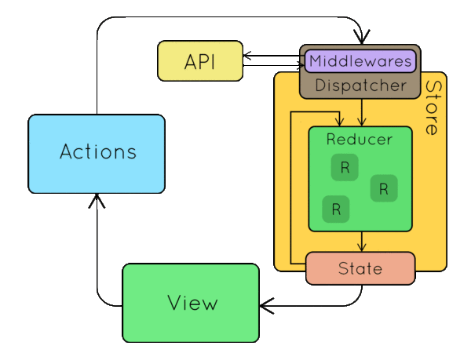
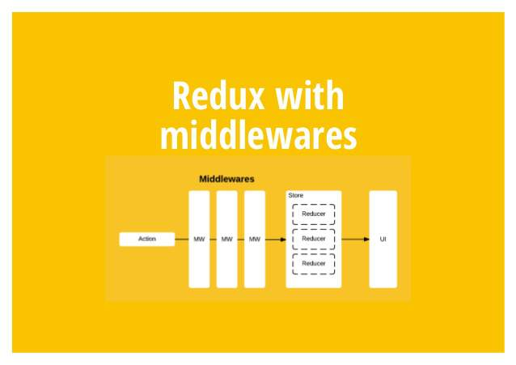

# 理念
状态机。View 和 State 一一对应，和 MVVM 理念相似

# 核心概念
- Store: createStore(reducer, INIT_STATE?, applyMiddleware(middleware)?)，数据存储容器，整个应用只有一个 Store
- State: store.getState()，数据存储容器的某个时刻的状态/快照
- Action: {type, payload}. View 层发出的通知，表示 State 要发生变化了
- Action creator: 工厂模式构建 action
- Reducer: (currentState, action) => { return newState}, 纯函数，负责生成新的 State（同步）
- Middleware: 中间件对原有的 store.dispatch() 添加了钩子，在发出 Action 和执行 Reducer这两步之间，执行特定中间件的逻辑。Middleware 可以发出异步 Action（包括三个：onDispatchAction, onActionSucceed, onActionFailed）


# 关系
- store.dispatch(action): redux 自动调用 reducer 更新当前视图状态
- store.subscribe(() => { ... }), 在这里更新 View 层

# redux 相关库
## react-redux
react 官方的 redux 实现，使 react 组件可以从 redux store 中获取数据，并 dispatch actions to store

### 核心 API
- Provider: `<Provider store>` 使组件层级中的 connect() 能够获取到 Redux store
- connect(mapStateToProps, mapDispatchToProps)(Component): 
  - mapStateToProps?: (state, ownProps) => {}; **每次状态改变时重新调用**。从 store 中取数据给UI组件
  - mapDispatchToProps?: Function | Object; 响应UI组件的事件回调
    - Object: `{ [key: String]: (arguments?) => dispatch(actionCreator()) }`
      - dispatch(actionCreator()): dispatch an action when called
    - `Function: (dispatch, ownProps?) => Object: { [key: String]: (arguments?) => dispatch(actionCreator()) }`, 当函数有第二个参数 `ownProps` 时，每当 ownProps 变化时，`mapDispatchToProps` 会重新被调用
  - 以上两个属性都为组件添加 props，分别为 props 和 actionCreators。前者通常在 View 层使用，后者通常在发生 UI 交互时调用，导致数据流发生转变： View -> Model。
  - 整体都数据流向为：
    - 用户交互导致数据状态变化：UI(EventListenor in mapDispatchToProps) -> Actions(ActionCreator) -> Reducers(ActionConsumer) -> Store(Database)
    - 非交互类的代码导致数据状态变化（如生命周期）：Store -> subscribe -> render -> UI
- connectAdvanced():
- batch()
- Hooks:

## redux-actions
redux 将 Action 和 Reducer（Action 的消费者）从业务逻辑中解耦出来，集中处理，使代码更具条理性，对于大型应用的数据流向有很大的帮助。但是，这种实现方式增加了很多冗余代码，使开发者不停的创建 Action 和 Reducer，非常麻烦。 `redux-actions` 旨在解决这一问题。

**单个 Action 的创建和处理**
``` javascript
import { createStore } from 'redux'
import { createAction, handleAction } from 'redux-actions'

const increment = createAction('INCREMENT');
const reducer = handleAction(
  increment,
  (state, action) => ({
    ...state,
    counter: state.counter + 1
  }),
  defaultState
);
const store = createStore(reducer, defaultState);
const render = () => {
    // ...
}
store.subscribe(render)
el.addEventListener('click',() => {
    store.dispatch(increment())
})
```

**多个 Action 的创建和处理**
``` javascript
import { createStore } from 'redux'
import { createActions, handleActions, combineActions, } from 'redux-actions'

const { increment, decrement } = createActions({
  INCREMENT: (amount = 1) => ({ amount }),
  DECREMENT: (amount = 1) => ({ amount: -amount })
});

// 方法1
const reducer = handleActions(
  {
    [increment]: (state, { payload: { amount } }) => {
      return { ...state, counter: state.counter + amount };
    },
    [decrement]: (state, { payload: { amount } }) => {
      return { ...state, counter: state.counter + amount };
    }
  },
  defaultState
);

// 更简洁
const reducer = handleActions(
  {
    [combineActions(increment, decrement)]: (
      state,
      { payload: { amount } }
    ) => {
      return { ...state, counter: state.counter + amount };
    }
  },
  defaultState
);
```

## redux-thunk
**thunk**：A thunk is a function that wraps an expression to delay its evaluation.

redux 中间件，用于满足**异步构建 Action**和**条件构建 Action**

当使用 redux-thunk 中间件时，Action Creator 除了可以返回 Action 对象外，还可以返回形如 `(dispatch) => { dispatch(action) }` 的函数，这个函数会被 redux-thunk middleware 执行。

``` javascript
// 异步构建
const INCREMENT_COUNTER = 'INCREMENT_COUNTER';

function increment() {
  return {
    type: INCREMENT_COUNTER
  };
}

function incrementAsync() {
  return dispatch => {
    setTimeout(() => {
      // Yay! Can invoke sync or async actions with `dispatch`
      dispatch(increment());
    }, 1000);
  };
}

// 条件构建
function incrementIfOdd() {
  return (dispatch, getState) => {
    const { counter } = getState();

    if (counter % 2 === 0) {
      return;
    }

    dispatch(increment());
  };
}
```

## redux-promise
dispatch Promise

## redux-rx
dispatch Observable

## redux-saga
创建更加复杂的异步 action

## redux-pack
dispatch Promise

## react-router-redux

## redux-devtools
**redux调试工具**，可以安装 chrome 插件版

## redux-devtools-log-monitor
记录页面的所有 action 和 state 的变化流水，并将结果展示在任何 div 中

## redux-devtools-dock-monitor
将 redux devtools 以 docker 的形式附在页面上

## 

# 常见项目组织结构
## 按照文件类型
react-redux 官网 demo 所采用的形式
```
|-- src
  |-- actions                         Actions
    |-- action-1.jsx                export { ACTION_TYPE, actionCreator }
    |__ action-2.jsx
  |-- containers                      容器组件/有状态组件/
    |-- container-1.jsx
    |__ container-2.jsx
  |-- components                      UI 组件/无状态组件/
    |-- components-1.jsx
    |-- components-2.jsx
  |-- reducers                        Reducers
    |-- reducer-1.jsx               同步/异步 reducer
    |-- reducer-2.jsx
  |-- index.jsx                       入口
```

## 按照组件功能
这种形式和 Angular 类似
```
|-- src
  |-- components                    公共组件
  |-- pages                         业务逻辑
    |-- page1
      |-- action.jsx
      |-- container.jsx
      |-- reducer.jsx
      |-- container.jsx
    |-- page2
      |-- ...
```

## Ducks
```
|-- src
  |-- components                    公共组件
  |-- containers
    |-- page1
      |-- components                子组件
      |-- container.jsx             容器组件
      |-- index.jsx                 
    |-- page2
  |-- redux
    |-- index.js
    |-- module1.jsx                 export { ACTION_TYPE, reducer, actionCreator }
    |-- module2.jsx
  |-- index.jsx
```